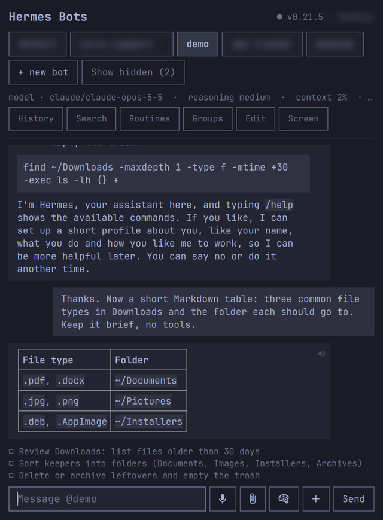
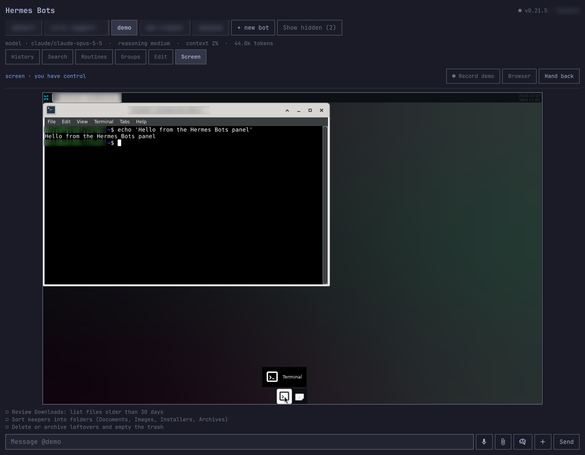
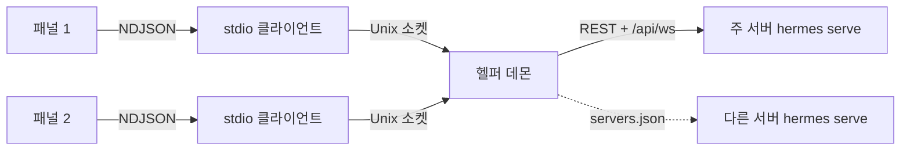

# puri.hermes — Hermes Bots for Omarchy

Omarchy(Hyprland/Quickshell) 바 위젯에서 원격 [Hermes Agent](https://github.com/NousResearch/hermes-agent) 봇을 만들고, 관리하고, 대화하는 플러그인입니다.

| 대화 | 패널 안 Screen |
| :---: | :---: |
|  |  |

<sub>캡처의 다른 봇 이름과 계정 정보는 흐리게 가렸습니다.</sub>

## 목차

- [빠른 시작](#빠른-시작)
- [기능](#기능)
  - [대화](#대화) · [봇 관리](#봇-관리) · [작업 지켜보기와 끼어들기](#작업-지켜보기와-끼어들기) · [Screen](#screen)
  - [그룹 채팅](#그룹-채팅) · [서버 여러 개](#서버-여러-개) · [그 밖의 기능](#그-밖의-기능)
- [단축키와 표시](#단축키와-표시)
- [발송 검토 Hermes 플러그인](#발송-검토-hermes-플러그인)
- [구조](#구조)
- [IPC](#ipc)
- [로드맵](#로드맵)

---

## 빠른 시작

**필요한 것:** Omarchy 셸, [Bun](https://bun.sh), `hermes serve`가 도는 서버

1. 이 저장소를 플러그인 폴더에 둡니다.

   ```sh
   git clone https://github.com/Puri12/omarchy-hermes-bots ~/.config/omarchy/plugins/puri.hermes
   ```

2. 접속 정보 파일 `~/.config/hermes-remote/credentials.env`를 만듭니다.

   ```sh
   mkdir -p ~/.config/hermes-remote
   install -m 600 /dev/null ~/.config/hermes-remote/credentials.env
   ```

   ```ini
   HERMES_REMOTE_URL=http://<hermes-serve-host>:9119
   HERMES_REMOTE_USER=<basic auth user>
   HERMES_REMOTE_PASSWORD=<basic auth password>
   ```

3. 바에 **Hermes Bots** 위젯을 추가하고 셸을 다시 시작합니다.

   ```sh
   omarchy restart shell
   ```

> [!IMPORTANT]
> `credentials.env`의 권한은 `600`으로 두고, 이 값은 저장소에 넣지 마세요.

> [!TIP]
> 다른 서버의 봇도 같은 목록에서 쓰려면 [서버 여러 개](#서버-여러-개)를 보세요.

---

## 기능

### 대화

- **스트리밍 답변** — 답이 오는 대로 보이고, 작업 상태줄에 `thinking` / `writing` / 도구 이름과 경과 시간, 토큰·컨텍스트 사용량이 표시됩니다.
- **Markdown** — 코드 블록은 말풍선 폭 안에서 줄바꿈되고, 코드 조각은 본문과 같은 크기, Markdown 이미지(``)는 링크로 표시됩니다. 스트리밍 중에는 답의 마지막 덩어리만 다시 그립니다(`MarkdownBody.qml`).
- **스크롤** — 맨 아래에 있을 때만 새 글을 따라갑니다. 위로 올려 읽는 동안에는 답이 들어와도 자리가 그대로이고, 보내기·봇 바꾸기·맨 아래로 내리기를 하면 다시 따라갑니다.
- **입력 초안** — 보내지 않은 글은 봇마다 따로 기억됩니다. 셸을 다시 시작하면 지워집니다.
- **여러 줄 입력** — <kbd>Shift</kbd>+<kbd>Enter</kbd>로 줄바꿈합니다.
- **첨부** — 이미지·파일 보내기와 받기(파일 칩).
- **대화 검색** — History 옆 **Search**로 현재 대화에서 글자가 들어간 줄만 보입니다(일치 수 표시, <kbd>Esc</kbd>로 닫기).
- **답장 인용** — 말풍선을 오른쪽 클릭하면 입력창 위에 `↩ replying to`가 뜨고, 보낼 때 `> ` 인용으로 붙습니다(× 로 취소).
- **History** — 지난 대화 열기, 이름 바꾸기, 보관, 삭제(두 번 클릭). 다시 불러온 대화의 cron 지시문과 첨부 확장문은 접혀 있고 클릭하면 펼쳐집니다.
- **스킬 `/`** — 입력창이 `/`로 시작하면 봇의 스킬 제안(최대 6개)이 뜹니다.

  <details>
  <summary>스킬 제안 자세히</summary>

  - <kbd>↑</kbd> / <kbd>↓</kbd>로 이동, <kbd>Tab</kbd>이나 클릭으로 완성, <kbd>Esc</kbd>로 닫기
  - `/스킬이름 …`은 `command.dispatch`로 실행되고, 대화에는 게이트웨이의 표시 문구가 남습니다.
  - 모르는 `/x`는 그냥 텍스트로 보냅니다.
  - Edit의 **Save as skill**은 마지막으로 보낸 질문을 SKILL.md로 저장합니다(삭제 API는 없음).

  </details>

### 봇 관리

| 할 일 | 방법 |
| --- | --- |
| 만들기 | **+ new bot** |
| 설명·SOUL 편집, 복제, 고정, 숨김 | **Edit** |
| 삭제 | Edit 맨 아래, 2단계 확인 |
| 모델 바꾸기 | 입력줄의 모델 버튼 → **MODEL** |
| 추론 강도 | 모델 버튼 → **REASONING**에서 `none` … `max` |
| 구역(섹션)으로 묶기 | Edit → **SECTION** |
| 템플릿 내보내기·가져오기 | Edit → **Export** / **Import** |

- **추론 강도**는 그 봇의 `config.yaml`(`agent.reasoning_effort`)에 저장되고, 열려 있는 대화에도 바로 적용됩니다. 모델 옆에 `reasoning <값>`으로 표시됩니다.

<details>
<summary>봇 구역(SECTION) 자세히</summary>

- 구역 칩을 누르거나 새 이름을 넣고 **Move**하면 그 구역으로 옮겨집니다. 자기 구역 칩을 다시 누르면 해제됩니다.
- 봇 목록은 구역 순서대로 묶여 보이고, 구역에 없는 봇은 맨 아래 **UNASSIGNED**에 모입니다. 마지막 봇이 나가면 그 구역은 사라집니다.
- 배치는 노트북의 `~/.hermes/bot-sections.json`에 [hermes-bot-kit](https://github.com/thomasbek3/hermes-bot-kit)의 Bot Sections와 같은 형식(`sections` 순서, `assign` 봇→구역)으로 저장됩니다. Hermes Desktop에 그 키트를 깔면 같은 배치가 보입니다.
- 파일을 직접 고치면 최대 1분 안에 반영됩니다.

</details>

<details>
<summary>봇 템플릿 자세히</summary>

- **Export**는 역할(설명·SOUL)·모델·직접 만든 스킬·루틴을 `~/Downloads/hermes-bot-<봇>.json`에 저장합니다.
- **Import**에 파일 경로와 새 봇 이름을 넣으면 그대로 새 봇이 만들어집니다.
- 대화·기억·자격 증명은 들어가지 않습니다.

</details>

### 작업 지켜보기와 끼어들기

| 상황 | 패널에서 |
| --- | --- |
| 답하는 중에 방향을 바꾸고 싶음 | **Steer**(지금 턴에 끼워 넣기) 또는 **Queue**(턴이 끝난 뒤 실행) |
| 멈추고 싶음 | **Stop** |
| 봇이 되묻거나 승인을 구함 | 질문·승인 카드가 뜨고 긴급 알림이 옴 |
| 봇이 일을 나눠 맡김(`delegate_task`) | 입력창 위에 작업자마다 한 줄, **Steer** / **Stop** |
| 봇이 할 일 목록을 씀 | 입력창 위에 할 일 목록 |
| 루틴(cron)이 끝남 | 완료 알림 |

<details>
<summary>위임 작업자 자세히</summary>

- 대화에 `🔀 delegated / completed` 줄이 남고, 돌고 있는 작업자마다 `경과 시간 · 마지막 도구 · 목표` 한 줄이 생깁니다. 부모 답이 끝난 뒤에도 남아 있습니다.
- **Steer**는 입력창에 쓴 글을 그 작업자에게 보냅니다. 입력창이 비어 있으면 그 작업자를 겨냥해 두고 <kbd>Enter</kbd>로 보내며, 다시 누르면 취소됩니다. 작업자는 지금 하던 도구 호출이 끝난 뒤에 읽습니다.
- **Stop**은 그 작업자만 멈춥니다.
- 패널을 다시 띄워도 서버의 작업자 목록으로 복원됩니다.

</details>

**Routines**에서는 루틴 목록·만들기·즉시 실행·일시정지·삭제·실행 기록을 다룹니다.

### Screen

봇 데스크톱을 패널 안에서 보고 조작합니다.

1. **Screen**을 누르면 패널이 넓어지고 대화 자리에 봇 화면이 뜹니다. 화면은 바뀔 때만, 초당 최대 약 8장으로 갱신됩니다.
2. **Take over**를 누르면 클릭·드래그·휠·키보드가 봇 화면으로 갑니다. 화면을 한 번 누르면 테두리가 강조색이 되고 키 입력을 받으며, 그동안 패널 단축키는 꺼집니다. 한글처럼 입력기(IME)로 조합하는 글자는 화면 아래에 조합 중인 글자가 보이고, 글자가 완성되면 봇 화면에 입력됩니다.
3. **Hand back**으로 봇에게 돌려줍니다. **Screen**을 다시 누르거나 패널을 닫아도 화면 받기가 멈추고 조작권은 봇에게 돌아갑니다.

- 화면은 압축(ZRLE)해서 받습니다. 전체 화면 한 장이 약 50~60KB로, 압축하지 않을 때(1440×900에서 약 5MB)의 약 1%입니다.
- 패널 두 개가 같은 봇 화면을 보면 화면 받기를 함께 씁니다. 한쪽이 닫히거나 사라져도 다른 쪽은 계속 보고, 보던 봇을 지우면 화면 받기도 멈춥니다.

> [!NOTE]
> 브라우저 페이지가 필요하면 화면 줄의 **Browser**를 누르세요.

<details>
<summary>시연으로 스킬 만들기 (Record demo)</summary>

1. Screen 줄의 **● Record demo**를 누르면 봇 화면을 넘겨받고 브라우저 화면 페이지가 열립니다.
2. 화면에서 직접 한 번 해 보입니다.
3. **■ Stop & teach**를 누르면 그동안의 입력(클릭·더블클릭·드래그·스크롤·입력한 글자·단축키)이 단계 목록으로 봇에게 전달되고, 봇이 SKILL.md 초안을 답합니다.
4. 초안 카드의 **Save skill**로 그 봇의 스킬로 저장합니다. 서버가 거절하면 이유가 카드에 표시됩니다.

입력은 헬퍼가 화면으로 중계하는 RFB 메시지에서 읽으므로, 브라우저 화면 페이지에서 한 조작만 기록됩니다.

</details>

### 그룹 채팅

**Groups**에서 봇 2~6개를 골라 이름을 넣고 **Create group**을 누릅니다. 방에서는 모두에게, 또는 `@봇`으로 한 봇에게 말을 걸 수 있고, 봇들은 Hermes Desktop 그룹 채팅과 같은 서버 방(hosted room)에서 차례로 답합니다.

| 할 일 | 방법 |
| --- | --- |
| 답하는 중 멈추기 | **Stop** |
| 이름 바꾸기 | **Rename** |
| 방 삭제 | **Delete group** (두 번 클릭) |
| 스레드로 답하기 | 방의 메시지 클릭 (봇 메시지면 `@봇`이 입력칸에 채워짐, × 로 취소) |
| 방 안 명령 승인 | 방 화면의 **Approve once** / **Deny** 카드 |
| 결과 없이 끝난 턴 | **Retry** 카드 |

- 열어 둔 방의 기록은 패널이 열려 있는 동안 2.5초마다 받아 옵니다.
- 보고 있지 않은 방은 헬퍼가 20초마다 확인합니다. 봇의 새 메시지가 오면 데스크톱 알림(`@user`·`@all`로 부르면 긴급)과 Groups 버튼·방 목록의 `•` 표시가 뜨고, 알림을 누르면 그 방이 열립니다.

> [!NOTE]
> 멤버 바꾸기는 서버에 RPC가 없어 지원하지 않습니다.

### 서버 여러 개

다른 Hermes 서버의 봇도 같은 목록에 나오고, 대화·스트리밍·중지·질문/승인 카드·History·Routines·Edit가 똑같이 동작합니다.

`~/.config/hermes-remote/servers.json`(권한 600)을 만듭니다.

```json
[
  { "id": "laptop", "label": "Laptop", "url": "http://127.0.0.1:9119", "envFile": "~/.config/hermes-remote/laptop.env" }
]
```

| 키 | 뜻 |
| --- | --- |
| `id` | 영문 소문자·숫자·`-`·`_`. 그 서버의 기본 봇 이름이 되고, 다른 봇은 `id.봇이름`으로 보입니다. 주 서버의 봇 이름과 겹치면 안 됩니다. |
| `label` | 상태줄에 보이는 서버 이름 |
| `url` | 그 서버의 `hermes serve` 주소 |
| `envFile` | 접속 비밀 값이 든 파일. `HERMES_DASHBOARD_SESSION_TOKEN`(세션 토큰으로 띄운 `hermes serve`) 또는 `HERMES_REMOTE_USER`·`HERMES_REMOTE_PASSWORD` |

> [!IMPORTANT]
> 비밀 값은 `servers.json`에 적지 말고 `envFile`에 두세요. 파일을 고친 뒤에는 `omarchy restart shell`이 필요합니다.

- 서버가 응답하지 않으면 그 서버 봇만 목록에서 빠지고 상태줄에 `· Laptop off`가 뜹니다. 30초마다 다시 확인해 돌아오면 자동으로 다시 나타납니다.
- 주 서버가 꺼져 있으면 상태줄에 `main server off`가 뜨고, 다른 서버의 봇은 계속 쓸 수 있습니다.
- `servers.json`이 잘못되어 있어도 주 서버 봇은 그대로 뜨고, 패널에 오류가 표시됩니다.
- Screen·그룹 채팅·받아쓰기는 주 서버 것만 씁니다.

### 그 밖의 기능

<details>
<summary>음성 — 읽어 주기와 받아쓰기</summary>

- 봇 말풍선의 🔊는 서버 TTS(`/api/audio/speak`) 음성을 `pw-play`로 재생합니다. 다시 누르면 멈춥니다.
- 입력줄의 **Mic**는 노트북 마이크를 `pw-record`로 녹음해, 서버 STT(`/api/audio/transcribe`)로 받아쓴 글을 입력창에 넣습니다.

**참고:** 받아쓰기는 서버에 STT 엔진(예: faster-whisper)이 있어야 합니다. 없으면 서버 오류를 그대로 보여 줍니다.

</details>

<details>
<summary>발송 초안 카드 — 봇이 메시지를 보내기 전에 확인</summary>

- 봇이 `send_message`로 메시지를 보내려 하면 수신자와 본문이 카드로 뜨고, **Send**를 눌러야만 발송됩니다.
- **Discard**는 폐기, **Edit…**는 폐기한 뒤 고쳐 보낼 지시문을 입력창에 채워 줍니다. 봇이 다시 보내려 하면 새 카드가 뜹니다.
- 이번 한 번만 승인하는 버튼만 있어서, 이후 발송이 검토 없이 나가지 않습니다.
- 서버에 [발송 검토 Hermes 플러그인](#발송-검토-hermes-플러그인)이 켜져 있어야 동작합니다.

</details>

<details>
<summary>서버 공지 배너</summary>

크레딧 경고·소진·복구, 에이전트 시작 지연, 속도 제한·모델 대체 경고가 헤더 아래 색 배너로 뜹니다. × 로 닫고, 시간제 공지는 저절로 사라집니다.

</details>

<details>
<summary>패널 구성</summary>

- History·Groups·Routines·Edit·모델·새 봇 칸은 한 번에 하나만 열리고, 길어지면 그 안에서 스크롤됩니다.
- Edit, 열린 그룹 방, Screen은 대화 자리를 대신 씁니다.
- 입력줄의 받아쓰기·첨부·모델·새 대화는 아이콘 버튼이고, 마우스를 올리면 설명이 뜹니다.
- 서버 주소는 상태줄에 마우스를 올리면 보입니다. 연결이 끊기면 **Reconnect** 버튼이 뜹니다.

</details>

---

## 단축키와 표시

패널에 포커스가 있을 때 쓰는 단축키입니다. Screen을 조작하는 동안에는 꺼집니다.

| 키 | 동작 |
| --- | --- |
| <kbd>Ctrl</kbd>+<kbd>N</kbd> | 새 대화 |
| <kbd>Ctrl</kbd>+<kbd>K</kbd> | History |
| <kbd>Ctrl</kbd>+<kbd>F</kbd> | 대화 검색 |
| <kbd>Ctrl</kbd>+<kbd>↑</kbd> | 마지막으로 보낸 메시지 불러오기 (입력창이 비어 있을 때) |
| <kbd>Alt</kbd>+<kbd>1</kbd> … <kbd>Alt</kbd>+<kbd>9</kbd> | 봇 목록의 N번째 봇 선택 |
| <kbd>Shift</kbd>+<kbd>Enter</kbd> | 줄바꿈 |

봇 목록의 봇 이름 옆 표시입니다.

| 표시 | 뜻 |
| :---: | --- |
| `?` | 내 답을 기다림 |
| `…` | 작업 중 |
| `⏱` | 예약 작업 실행 중 |
| `•` | 보지 않는 동안 새 답장·알림 (선택하면 지워짐) |

---

## 발송 검토 Hermes 플러그인

`hermes-plugin/outbound-review`

Hermes에는 발송 전 검토 단계가 없어서, [발송 초안 카드](#그-밖의-기능)는 이 서버 플러그인이 `send_message`의 send 호출을 Hermes 승인 절차로 넘길 때만 나타납니다. 플러그인은 수신자와 본문을 승인 요청에 담고, 거절·시간 초과·오류면 발송을 막습니다(fail closed).

검토할 봇마다, Hermes가 도는 서버에서 설치합니다.

1. 플러그인 폴더를 그 봇의 홈에 복사합니다.

   | 봇 | 위치 |
   | --- | --- |
   | 기본 봇 | `~/.hermes/plugins/outbound-review` |
   | 다른 봇 | `~/.hermes/profiles/<봇>/plugins/outbound-review` |

2. 그 봇의 `config.yaml`(기본 봇은 `~/.hermes/config.yaml`, 다른 봇은 `~/.hermes/profiles/<봇>/config.yaml`)에 추가합니다.

   ```yaml
   plugins:
     enabled: [outbound-review]
   ```

3. `hermes serve`를 다시 시작합니다. 메시지 게이트웨이를 쓰면 그것도 다시 시작합니다.

---

## 구조

| 파일 | 하는 일 |
| --- | --- |
| `Panel.qml` | 바 아이콘과 패널 UI (Quickshell, `qs.Ui` 컴포넌트) |
| `MarkdownBody.qml` | 답변 Markdown 그리기 |
| `hermes-remote.ts` | Bun 헬퍼. 패널과 NDJSON(stdin/stdout)으로 통신하고, `hermes serve`의 REST와 `/api/ws` JSON-RPC에 붙음 |
| `novnc/` | 브라우저 화면 페이지용 noVNC 1.7.0 (MPL-2.0, `novnc/LICENSE.txt`) |
| `hermes-plugin/outbound-review/` | 서버 쪽 발송 검토 플러그인 |

### 헬퍼 데몬

바는 패널을 두 개 띄우지만 백엔드 연결은 하나입니다.



- 데몬이 로그인·WebSocket·루틴(cron) 확인·봇 화면 연결을 모두 맡고, 이벤트는 모든 패널에 똑같이 보냅니다. 데스크톱 알림은 한 패널만 띄웁니다.
- 서버마다 명령 대기열이 따로 있어서, 한 서버가 느리거나 꺼져 있어도 다른 서버 봇의 명령은 밀리지 않습니다.
- 데몬이 없으면 클라이언트가 띄우고, `omarchy restart shell`을 해도 데몬은 살아 있습니다.
- `hermes-remote.ts`나 `servers.json`이 바뀌면 다음 클라이언트가 옛 데몬을 끄고 새 데몬을 띄웁니다.
- 패널의 **Reconnect**(또는 IPC `reconnect`)는 데몬의 로그인과 WebSocket을 새로 맺습니다.

| 항목 | 위치 |
| --- | --- |
| 소켓 | `$XDG_RUNTIME_DIR/puri-hermes.sock` (없으면 `/tmp/puri-hermes-$UID.sock`, 권한 600) |
| PID | `~/.cache/puri.hermes/daemon.pid` |
| 로그 | `~/.cache/puri.hermes/daemon.log` |
| Screen 프레임 | `$XDG_RUNTIME_DIR/puri-hermes-screen/` (헬퍼가 RFB를 받아 BMP로 쓰고 패널이 그림) |

데몬 멈추기:

```sh
kill "$(cat ~/.cache/puri.hermes/daemon.pid)"
```

> [!NOTE]
> 패널이 열려 있으면 몇 초 뒤 다시 뜹니다. 완전히 멈추려면 위젯을 뺀 뒤 실행하세요.

---

## IPC

```sh
omarchy-shell puri.hermes <함수> [인자…]
```

<details>
<summary>함수 목록 펼치기</summary>

| 묶음 | 함수 |
| --- | --- |
| 패널 | `open` `close` `toggle` `show <bot>` `state` `reconnect` `geometry` `toggleModelPicker` `editView` `showHidden <true\|false>` |
| 봇 | `select <bot>` `create <name> <desc>` `armDelete <name>` `deleteBot <name>` `profileGet` `profileSave <desc> <soul>` `profileDuplicate <newName>` `pin <true\|false>` `hide <true\|false>` `setModel <id>` `setEffort <level>` `effort` `section <name>` `sections` |
| 템플릿 | `templateExport` `lastTemplate` `templateImport <path> <name>` |
| 대화 | `send <text>` `steer <text>` `queue <text>` `stop` `newChat` `answer <text>` `approve <once\|session\|always\|deny>` `search <text>` `quote <index>` `unread` `notices` |
| 첨부·파일 | `attachFile <path>` `attachClipboard` `files` `openFile <name>` |
| 음성 | `dictate` `dictateFile <path>` `speakQuiet <text>` `lastSpeech` |
| History | `sessions` `listed` `openSession <id>` `sessionRename <id> <title>` `sessionArchive <id>` `sessionDelete <id>` |
| 작업자 | `subagents` `workers` `workerSteer <id> <text>` `workerStop <id>` |
| Routines | `routines` `routinesView <runsId>` `routineCreate <name> <schedule> <prompt>` `routineRun <id>` `routinePause <id>` `routineResume <id>` `routineDelete <id>` `routineRuns <id>` |
| Screen | `screenToggle` `screenInfo` `screenTake` `screenHandback` `screenState` `screenUrl` `demoStart` `demoStop` `demoState` `saveSkillDraft` |
| 발송 초안 | `draftState` `draftAction <action>` |
| 그룹 | `groupsView` `groups` `groupCreate <name> <bot,bot>` `groupOpen <id>` `groupSend <text>` `groupDisband <id>` `roomRename <name>` `roomReplyLast` `room` `roomAnswer <once\|deny>` `groupUnread` `showGroup <id>` |
| 스킬 | `skills` `skillSave <name> <SKILL.md>` |
| 시험용 | `setComposer <text>` `chatScroll <fraction>` `screenTap <fx> <fy>` `screenType <text>` `screenKeyTest <qtKey> <text> <modifiers>` `injectFrame <json>` |

- `skills`는 선택된 봇의 스킬 목록(캐시)을 JSON으로 돌려주고 새로 받아 옵니다. 서버가 스캔을 약 30초 캐시하므로 방금 저장한 스킬은 잠시 늦게 보일 수 있습니다.
- `setComposer <text>`는 입력창 글을 바꾸고, 지금 보이는 스킬 제안 이름을 JSON으로 돌려줍니다.
- `chatScroll <fraction>`은 대화를 스크롤 범위의 비율(0 맨 위, 1 맨 아래, 음수는 이동 없이 읽기)로 옮기고 위치를 돌려줍니다.
- `screenTap`과 `screenType`은 패널 Screen의 마우스·키 경로로 클릭과 입력을 보냅니다(Take over 뒤에만 먹힘).
- `screenKeyTest`는 Qt 키 코드·글자·수식키를 키보드와 같은 처리 함수에 넣고, 보낸 keysym(16진수)이나 `ime`(입력기에 맡김)를 돌려줍니다.
- `approve`는 승인 카드의 버튼과 같은 답을 보냅니다.

</details>

---

## 로드맵

[`ROADMAP.md`](ROADMAP.md)를 보세요.
